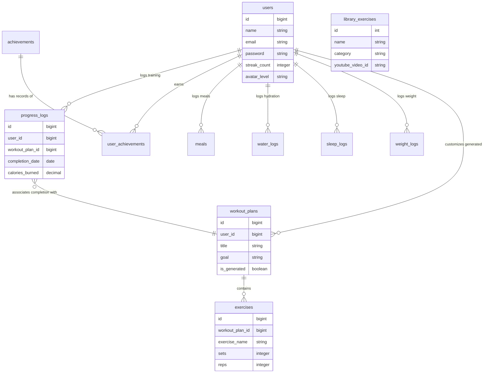

# AI-Powered Smart Workout Plan Generator

## Overview
A modern full-stack fitness web application that generates customizable workout plans, provides progress tracking, AI-generated fitness insights (via Gemini API), recovery recommendations, streak tracking, achievements, and smart analytics dashboards.

This application was designed with a futuristic, premium UI featuring dark themes, glowing effects, and glassmorphism. It uses a robust backend to manage users, workouts, and analytics while providing smooth animations via Framer Motion on the frontend.

## Features
- **Authentication**: Secure login/registration using Laravel Sanctum with dynamic forms for fitness profile setup.
- **AI Fitness Coach**: Gemini AI integration to generate workout insights, recovery advice, and difficulty prediction (gracefully falls back if API key is missing).
- **Workout Generator**: Algorithm matching user inputs (Goal, Intensity, Duration, Type) with predefined templates, dynamically scaling to meet constraints.
- **Progress Tracking & Streaks**: Log completed workouts and calories burned while building a consistency streak.
- **Gamification**: Unlock automatic achievements (e.g. First Workout, 7 Day Streak) and evolve fitness avatar level dynamically (+500 XP per logged workout) with dynamic leveling.
- **Dashboard**: Smart analytics utilizing Recharts to provide dynamic statistics, charts, and activity tracking, switching seamlessly between mock Live Telemetry and real SQL Database Telemetry.
- **Nutrition, Hydration & Sleep Tracker**: Persist daily calorie & macronutrient goals, log water consumption with an interactive liquid beaker animation, and track sleep hygiene hours directly in your database.

## Tech Stack
- **Backend**: Laravel 12, Sanctum, SQLite / MySQL, Gemini API Service
- **Frontend**: React (Vite), Tailwind CSS v4, Axios, React Router, Zustand, Framer Motion, Recharts, Lucide React Icons

## Folder Structure
- `backend/`: Laravel REST API backend
- `frontend/`: React + Vite frontend application

## Setup Instructions

### Backend Setup
1. Open the `backend/` directory.
2. Run `composer install` to install dependencies.
3. Configure your `.env` file (copy `.env.example` to `.env` if needed) and set your database connection.
4. Run `php artisan migrate:fresh --seed` to run migrations (including meals, water logs, and sleep logs) and populate dummy workout plans and exercises.
5. Provide your `GEMINI_API_KEY` in the `.env` file to enable AI functionality.
6. Start the development server using `php artisan serve`.

### Frontend Setup
1. Open the `frontend/` directory.
2. Run `npm install` to install node dependencies.
3. Start the development server using `npm run dev`.
4. Open the application on your browser (`http://localhost:5173` typically).

## Environment Variables
Ensure the following are correctly set in the backend `.env`:
```env
APP_URL=http://localhost:8000
FRONTEND_URL=http://localhost:5173
SANCTUM_STATEFUL_DOMAINS=localhost:5173

DB_CONNECTION=sqlite # Or mysql, based on preference

GEMINI_API_KEY=your_gemini_api_key_here
```

## API Endpoints
- `POST /api/register` : User Registration
- `POST /api/login` : User Authentication
- `POST /api/logout` : End Session
- `GET /api/user` : Fetch authenticated user info
- `GET /api/dashboard` : Fetch user dashboard stats and weekly charts
- `POST /api/workout/generate` : Retrieve generated AI workout plan
- `POST /api/progress/log` : Save workout completion and unlock streaks/achievements
- `GET /api/nutrition` : Fetch today's accumulated meals, sleep hours, and water logs
- `POST /api/nutrition/meal` : Log a new meal with detailed macros
- `DELETE /api/nutrition/meal/{id}` : Delete a logged meal
- `POST /api/nutrition/water` : Log water intake (in ml)
- `POST /api/nutrition/water/reset` : Reset daily water intake back to 0ml
- `POST /api/nutrition/sleep` : Update hours slept for today

## Customizable Targets & Core Algorithms

### 1. Customizable Targets
Users can modify their daily hydration target (ml) and daily calorie target (kcal) directly from the **Settings > Profile** panel. The application automatically updates daily wellness milestones and dynamically calculates default macronutrient distributions (25% Protein, 50% Carbs, 25% Fats) based on the user's custom daily calorie budget.

### 2. Goal Projections & Database-Backed Customization
The **Goal Projections** panel on the Biometric Progress Dashboard (`ProgressDashboard.jsx`) tracks your mid-term and long-term milestones dynamically:
- **Weekly Workouts Target**: Allows the user to configure their weekly training volume (e.g., 5 sessions per week target). It counts logged sessions completed since the start of the week.
- **Monthly Calorie Burning Goal**: Tracks the cumulative **active calories burned** during your completed workouts against a customizable monthly expenditure target.
- **Daily Hydration Tracker**: Real-time hydration level indicators matching today's logged water intake against your water goal.

All three targets are completely customized inside the database under the following `users` table columns:
- `weekly_workout_frequency`: Weekly Workouts Target (sessions)
- `monthly_burn_target`: Monthly Calorie Burning Goal (kcal)
- `daily_water_target`: Daily Hydration Target (ml)

These can be edited directly inside the **Account Settings > Profile** form, which maps them safely to your SQL database.

### 3. Today's Schedule Focus Panel
Displays the user's current workout objective for the day:
- **Active Program**: If the most recent logged item is an AI-generated/public plan, it displays `"Active Program: [Plan Title]"`.
- **Custom Session**: If the most recent log is a custom split, it displays `"Custom Session: [Split Name]"` (e.g. `Custom Session: djk vd`).
- **AI Tips/Insights**: Displays a dynamically calculated coach insight tip (`dbData.ai_tips` from the backend). For instance: *"Stay hydrated! Since you did strength training recently, focus on protein intake."* This changes dynamically based on recent log categories.

### 4. Biometric Status Panel & Recovery Score Algorithm
The Biometric Status widget on the main dashboard displays physiological indicators synced in real-time with the database:
- **Hydration Tracker**: Displays your current logged water intake today against your customizable daily target (e.g. `1,500 / 3,000 ml`).
- **Active Split Streak**: Tracks your consistency streak count from the database logs.
- **Recovery Rate Index**: Dynamically calculated in the backend using the formula:
  $$\text{Recovery Rate} = (\text{Sleep Factor} \times 0.6) + (\text{Fatigue Factor} \times 0.4)$$
  - **Sleep Factor (60% weight)**: `min(100, (sleepHours / 8.0) * 100)`. If you logged 8 hours of sleep today, you get a 100% sleep rating.
  - **Fatigue Factor (40% weight)**: Derived from the fatigue score of your last completed session:
    - Low Fatigue (Score 3): `100.0`
    - Medium Fatigue (Score 2): `75.0`
    - High Fatigue (Score 1): `40.0`
    - *If no logs exist, defaults to `90.0` (fully rested).*

### 5. Dynamic Recovery Rating (Logs Page)
The Recovery Rating visible on the **Workout Logs** page is dynamically computed based on the fatigue levels submitted by the user during workout logs:
- **Fatigue Mapping**:
  - `low` / `very_easy` / `easy` -> 3.0 (lowest strain, highest recovery potential)
  - `medium` / `moderate` -> 2.0 (standard muscle soreness)
  - `high` / `hard` / `very_hard` -> 1.0 (highest exhaustion, requiring rest)
- **Evaluation Metric**:
  - Average Fatigue Score >= 2.5: `"Excellent Recovery"`
  - Average Fatigue Score >= 1.6: `"Optimal Recovery"`
  - Average Fatigue Score < 1.6: `"High Strain Alert"`

## Intelligent Global Search Engine
The application incorporates a multi-dimensional, real-time search engine (`GlobalSearch.jsx`) that searches across three distinct domains instantly:
1. **App Navigation (Features)**: Matched against page titles, descriptions, and a rich list of keyword synonyms (e.g. typing "fats" or "food" directs you to the Nutrition Tracker).
2. **Workout Plans (Workplans)**: Matched against plan titles, target goals, intensities, descriptions, difficulty levels, and **nested exercise lists** (e.g. searching "Bench Press" returns workout plans containing that specific exercise).
3. **Exercise & Movement Library**: Matched against exercise names, target muscles, equipment types, difficulty levels, and categories.

### Key Snippets
* **Nested Exercise Querying & Deduplication**:
  ```javascript
  // Combine user-specific and offline mockup plans safely
  const plansList = Array.isArray(plans) ? plans : [];
  const allPlansCombined = [...plansList, ...mockPlans];
  
  // Deduplicate by ID and Title to prevent duplicate key rendering
  const uniquePlans = [];
  const planIds = new Set();
  const planTitles = new Set();
  for (const plan of allPlansCombined) {
      if (!plan) continue;
      if (!planIds.has(plan.id) && !planTitles.has(plan.title?.toLowerCase().trim())) {
          planIds.add(plan.id);
          planTitles.add(plan.title?.toLowerCase().trim());
          uniquePlans.push(plan);
      }
  }

  // Filter plans, including nested exercises
  const filteredPlans = lowerQuery
      ? uniquePlans.filter(p => 
          p.title?.toLowerCase().includes(lowerQuery) || 
          p.exercises?.some(ex => 
              ex.exercise_name?.toLowerCase().includes(lowerQuery) ||
              ex.name?.toLowerCase().includes(lowerQuery)
          )
        )
      : [];
  ```

---

## Contextual AI Fitness Coach Chatbot
FitForge-AI features a fully conversational, personalized **AI Fitness Coach Chatbot** (`AICoachPanel.jsx` / `/api/ai/chat`) powered by the Gemini API.

### Core Use Case
Unlike generic AI chatbots, the FitForge AI Coach is **fully contextualized with the user's real-time database logs and goals**. It acts as a dedicated personal trainer by ingesting:
- **Biometric Profile**: Age, weight, height, experience level, and fitness goals.
- **Wellness Goals**: Calorie budget, macro splits, hydration target, and sleep targets.
- **Daily Performance Metrics**: Calories consumed today, macros eaten (protein/carbs/fats), water intake, and sleep logged.
- **Workout Performance Logs**: Ingests recent workouts, including duration, calories burned, user-reported fatigue score, and custom workout notes.

### Safety Prompting
To prevent the model from confusing the user's daily food intake with workout energy expenditure (active calorie burn), the backend controllers supply strict system prompt parameters:
```php
$prompt .= "### TODAY'S ACTIVE & NUTRITION LOGS (Date: {$today}):\n";
$prompt .= "- Food Calorie Intake (Calories Consumed Today from food/meals): {$caloriesConsumed} kcal\n";
$prompt .= "- Active Workout Calories Burned Today: {$todayCaloriesBurned} kcal (This is calorie burn/energy expenditure, NOT food intake!)\n";

$prompt .= "IMPORTANT SAFETY CHECK: Do not confuse Calories Consumed (food eaten, currently {$caloriesConsumed} kcal today) with Workout Calories Burned (exercise burn, currently {$todayCaloriesBurned} kcal today). If the user asks about workouts, discuss their active calorie burn and duration. If they ask about food, discuss their calorie intake. Do not state that they burned their food intake value.\n";
```

### Examples of Contextual Inquiries
- *User:* "How is my nutrition today?"
  *AI Coach Response:* "You've logged 1,200 kcal out of your 2,500 kcal target. I see you've only consumed 50g of protein out of your 150g goal—try adding egg whites or greek yogurt to your next meal to hit your macro targets!"
- *User:* "Should I work out today?"
  *AI Coach Response:* "Based on your logs, you completed a high-intensity Strength Blast yesterday and reported high fatigue. Since your sleep was only 6 hours, I recommend focusing on hydration (you've drank 1.5L of your 3.5L goal) and taking an active recovery/mobility rest day today."

---

## Global Timezone Alignment (`X-User-Date` Header)
To support international users where the server's clock timezone (UTC) differs from the browser's local calendar date, the application utilizes a dynamic date synchronizer.

### 1. Frontend Header Injection (`axios.js`)
Axios interceptors capture your local system date at run-time and append it to all requests:
```javascript
// Interceptor to add token and local date
api.interceptors.request.use((config) => {
    const token = localStorage.getItem('token');
    if (token) {
        config.headers.Authorization = `Bearer ${token}`;
    }
    
    // Add user's current local date in YYYY-MM-DD format
    const localDate = new Date();
    const year = localDate.getFullYear();
    const month = String(localDate.getMonth() + 1).padStart(2, '0');
    const day = String(localDate.getDate()).padStart(2, '0');
    config.headers['X-User-Date'] = `${year}-${month}-${day}`;
    
    return config;
});
```

### 2. Backend Date Parsing (`NutritionController.php` / `ProgressController.php`)
Backend endpoints parse this header securely, falling back to UTC only if the header is absent or invalid:
```php
$today = $request->header('X-User-Date') ?? Carbon::today()->toDateString();
if (!preg_match('/^\d{4}-\d{2}-\d{2}$/', $today)) {
    $today = Carbon::today()->toDateString();
}

// Fetch meals logged for the user's specific local date
$meals = Meal::where('user_id', $user->id)
    ->where('logged_at', $today)
    ->get();
```

---

## Theme Mode Toggle Engine (Dark & Light)
To support both Light and Dark mode rendering without bloat, the application maps standard Tailwind v4 utility variables directly to custom CSS properties and manages state via a persistent Zustand store.

### 1. CSS Variable Custom Swapping (`index.css`)
We define variables in `:root` for dark theme (default) and override them under the `.light` class wrapper. Tailwind v4 theme is configured to consume these custom properties:
```css
@theme {
  --color-slate-950: var(--bg-950);
  --color-slate-900: var(--bg-900);
  --color-slate-800: var(--bg-800);
  --color-slate-700: var(--bg-700);
  --color-white: var(--text-white);
  /* ... */
}
```

### 2. State Controller (`useThemeStore.js`)
We use a Zustand store to persist the user's theme selection to `localStorage` and toggle the class on `document.documentElement`:
```javascript
export const useThemeStore = create((set) => {
    const initialTheme = localStorage.getItem('theme') || 'dark';
    
    // Apply class on load
    if (initialTheme === 'light') document.documentElement.classList.add('light');

    return {
        theme: initialTheme,
        toggleTheme: () => {
            set((state) => {
                const nextTheme = state.theme === 'dark' ? 'light' : 'dark';
                localStorage.setItem('theme', nextTheme);
                if (nextTheme === 'light') {
                    document.documentElement.classList.add('light');
                } else {
                    document.documentElement.classList.remove('light');
                }
                return { theme: nextTheme };
            });
        }
    };
});
```

### 3. Settings Toggler Switch (`Settings.jsx`)
Wires the Preferences panel toggle to control theme switching:
```javascript
<button 
    type="button"
    onClick={toggleTheme}
    className={`w-12 h-6 rounded-full relative cursor-pointer transition-all duration-300 ${
        theme === 'dark' ? 'bg-neon-green' : 'bg-slate-700'
    }`}
>
    <div className={`w-5 h-5 bg-slate-950 rounded-full absolute top-0.5 transition-all duration-300 ${
        theme === 'dark' ? 'right-0.5' : 'left-0.5'
    }`} />
</button>
```

## Dynamic Exercise Library & Interactive Tutorials

The Exercise Library has been upgraded from a client-side hardcoded mockup array to a fully database-driven system, fetching dynamic specifications, interactive YouTube tutorial frames, and biometric calibration data directly from the SQLite database.

### 1. Database Schema & Seeder (`library_exercises` Table)
The database migration seeds 50 premium fitness movements categorized across 10 specific categories (Chest, Back, Legs, Arms, Shoulders, Core, Cardio, HIIT, Yoga, Full Body). Each record stores:
- **Biomechanical Targets**: Target muscles (JSON array), equipment, and difficulty levels.
- **Execution Data**: Multi-step step-by-step instructions (JSON array), performance pro-tips, and calibration metrics (recommended sets & reps).
- **Media Identifiers**: Specific high-quality fitness trainer YouTube video IDs (e.g., `ultW1OlMcO0` for Squats, `gRVjAtPip0Y` for Bench Press) mapped to each exercise.

### 2. High-Fidelity YouTube Iframe Integration
The `ExerciseDetails.jsx` page renders a highly responsive, customized iframe to play standard, focused tutorial embeds:
```javascript
<iframe
    className="w-full h-full aspect-video"
    src={`https://www.youtube.com/embed/${exercise.youtube_video_id || 'gRVjAtPip0Y'}?modestbranding=1&rel=0`}
    title={exercise.name}
    frameBorder="0"
    allow="accelerometer; autoplay; clipboard-write; encrypted-media; gyroscope; picture-in-picture"
    allowFullScreen
/>
```
- **Modest Branding & rel Parameters**: `modestbranding=1&rel=0` parameters are injected to disable standard YouTube branding and restrict non-relevant recommendations, keeping the UI focused on fitness education.
- **Dynamic Previews**: Cards in the grid use dynamic YouTube frame captures (`https://img.youtube.com/vi/<youtube_video_id>/hqdefault.jpg`) as high-fidelity exercise covers.

### 3. Automated Routine Logging & Telemetry Sync
Clicking **"Add to Routine"** on any exercise details page automatically dispatches the exercise data to the database as a completed session:
- **Sync Event Flow**:
  1. The page builds a log payload mapping `exercise.name`, `calories`, `duration`, and execution details.
  2. The frontend store (`useProgressStore.js`) calls `addWorkoutLog` to send a POST request to `/api/progress/log`.
  3. The backend saves the progress log, dynamically registers cumulative workout minutes, increases the weekly workout session counters, updates streak counts, and pushes the consistency metrics directly to the user dashboard charts.
- **Success Feedback**: A dynamic success toast alerts the user: *"Successfully logged [Exercise Name] as a completed workout split!"*.

---

## Future Scope
- **Admin Panel**: Web interface for managing workouts, exercises, and system configuration.
- **Social Features**: Leaderboards and friends lists for fitness tracking.

---

# 🛡️ Laravel Backend Architecture Deep-Dive (Viva & Code-Review Guide)

This section acts as a comprehensive technical guide for developers, reviewers, and examiners. It details the complete architecture, database mappings, business logic algorithms, and underlying mechanics of the FitForge-AI backend.

---

## 1. ⚙️ Backend Technology Stack & Initialization Commands

### The Tech Stack
*   **Framework**: **Laravel 12** (PHP-based MVC web framework)
*   **Database Engine**: **SQLite** (Default local file-based database, stored inside `backend/database/database.sqlite`)
*   **Authentication Engine**: **Laravel Sanctum** (Token-based secure SPA authentication)
*   **External AI Service**: **Google Gemini API** (Interfaced via an HTTP service container)

### Commands to Initialize the Backend
Execute these commands inside the `backend/` directory in sequence to set up the environment from scratch:

```bash
# 1. Install all PHP package dependencies declared in composer.json
composer install

# 2. Copy the example configuration template to create your live env file
copy .env.example .env

# 3. Generate a secure, unique 32-character application encryption key
php artisan key:generate

# 4. Create the blank SQLite database file (required for SQLite driver)
type nul > database/database.sqlite

# 5. Clear all tables, run migrations, and seed templates & dynamic exercise libraries
php artisan migrate:fresh --seed

# 6. Spin up the local development API server (runs on http://127.0.0.1:8000)
php artisan serve
```

---

## 2. 📊 Database Architecture & Entity-Relationship (ER) Model

The database holds 10 custom tables linked together using Foreign Key constraints. Relationships are managed using **Eloquent ORM** relationships (hasMany, belongsTo, hasOne).

### Visual Database ER Diagram (Mermaid)



### Table Relationships Explained
1.  **Users Table (`users`)**: Represents the central entity.
    *   `hasMany` Relationship: Logs multiple training sessions (`progress_logs`), meals (`meals`), water logs (`water_logs`), sleep logs (`sleep_logs`), weight histories (`weight_logs`), custom workout routines (`workout_plans`), and unlocked achievements (`user_achievements`).
2.  **Workout Plans (`workout_plans`)**: Holds pre-seeded workouts or custom-generated plans.
    *   `belongsTo` Relationship: Belongs to a specific `user_id` (this is `nullable`—meaning plans with a `null` user ID are public templates accessible to everyone, while those with a user ID are AI-generated for that specific athlete).
    *   `hasMany` Relationship: Holds multiple specific exercises (`exercises`) via a foreign key relation.
3.  **Exercises (`exercises`)**: Defines individual movements inside a plan.
    *   `belongsTo` Relationship: Links back to its parent plan via `workout_plan_id` (cascades on delete).
4.  **Library Exercises (`library_exercises`)**: Global lookup repository storing details for all 50 movements, including their biomechanical focus and verified YouTube demonstration IDs. No direct relations—accessed as a master catalog.

---

## 3. 📂 Comprehensive Backend Directory Structure

Below is a complete directory structure of the backend repository:

```text
backend/
├── app/
│   ├── Http/
│   │   ├── Controllers/             # MVC Controllers (Handles HTTP request/response)
│   │   │   ├── AICoachController.php
│   │   │   ├── AuthController.php
│   │   │   ├── DashboardController.php
│   │   │   ├── LibraryExerciseController.php
│   │   │   ├── NutritionController.php
│   │   │   ├── ProgressController.php
│   │   │   └── WorkoutController.php
│   │   └── Middleware/              # Request interceptors (Sanctum auth guards)
│   ├── Models/                      # Eloquent ORM Classes (Database abstractions)
│   │   ├── Achievement.php
│   │   ├── Exercise.php
│   │   ├── LibraryExercise.php
│   │   ├── Meal.php
│   │   ├── ProgressLog.php
│   │   ├── SleepLog.php
│   │   ├── User.php
│   │   ├── UserAchievement.php
│   │   ├── WaterLog.php
│   │   ├── WeightLog.php
│   │   └── WorkoutPlan.php
│   └── Services/                    # External integrations & auxiliary classes
│       └── GeminiService.php        # Ingests context and calls Google Gemini API
├── config/                          # Central framework configurations (cors.php, sanctum.php)
├── database/
│   ├── migrations/                  # Schema definitions (Structured SQL table builders)
│   ├── seeders/                     # Initial database seeding scripts
│   │   ├── DatabaseSeeder.php
│   │   ├── LibraryExerciseSeeder.php
│   │   └── WorkoutPlanSeeder.php
│   └── database.sqlite              # The SQLite database binary file
├── routes/
│   ├── api.php                      # REST API routing endpoints (prefix: /api)
│   └── web.php                      # Basic web routes
└── storage/                         # Log and upload directories (storage/logs/laravel.log)
```

---

## 4. 📄 File-by-File Technical Purpose Map

To prepare for your viva, review the technical explanation and underlying code logic of each primary class below:

### Controllers (The Logic Coordinators)

#### 1. `AuthController.php`
*   **Purpose**: Manages user authentication cycles (Registration, Login, Profile Updates, Logout).
*   **Tech Highlight**: Uses **Sanctum Personal Access Tokens** via `$user->createToken('auth_token')->plainTextToken`. It hashes passwords securely using Laravel's `Hash::make()` (which uses bcrypt behind the scenes). It also maps settings inputs safely to database columns (e.g., mapping settings `goal` parameter to user `fitness_goal` database column).

#### 2. `WorkoutController.php`
*   **Purpose**: Matches user workout criteria with template plans, duplicates them as dynamic user-specific copies, and injects coach insights using the Gemini service.
*   **Tech Highlight**: Queries plans with the `exercises` relation using Eager Loading to optimize DB calls: `WorkoutPlan::with('exercises')`. If a dynamic plan matches the goal and type, it clones the core template and bulk-inserts all nested exercise entries for that user under `is_generated = true`.

#### 3. `ProgressController.php`
*   **Purpose**: Manages exercise logging, logs weight changes, evaluates streaks, updates avatar experience levels, and awards achievements.
*   **Tech Highlight**: Contains the core logic for the gamification cycle. Whenever a workout is logged:
    1.  Registers a new `ProgressLog` record.
    2.  Invokes `syncAchievements()` to check user progress against goals.
    3.  Calculates and saves streak counts and updates `avatar_level` benchmarks.

#### 4. `LibraryExerciseController.php`
*   **Purpose**: Exposes API endpoints for retrieving the 50 seeded fitness movements, filtering by category, search queries, or retrieving specific exercise details.

#### 5. `NutritionController.php`
*   **Purpose**: Coordinates the tracking of calories consumed, meal macros (Protein, Carbs, Fats), sleep hygiene logs, and water intake.
*   **Tech Highlight**: Implements a timezone date synchronizer. It extracts the request header `X-User-Date` to correctly record sleep, water, and meal entries on the user's *local* date, avoiding server offset errors.

#### 6. `DashboardController.php`
*   **Purpose**: Feeds the central dashboard statistics, calculates real recovery rates, pulls weekly activity chart datasets, and logs recent workouts.

#### 7. `AICoachController.php`
*   **Purpose**: Provides the conversational assistant panel with user context. It gathers biometric targets, nutrition logs, and workout history, compiles them into a structured prompt, and queries the Gemini engine.

---

### Models (The Database Mappers)

#### 1. `User.php`
*   Maps to the `users` table. Inherits `Authenticatable` and uses the `HasApiTokens` trait (Sanctum) which gives it token-generation methods.
*   Declares the complete `$fillable` configuration array to protect against mass-assignment vulnerabilities.

#### 2. `WorkoutPlan.php`
*   Maps to the `workout_plans` table.
*   Declares the `hasMany` relationship:
    ```php
    public function exercises() {
        return $this->hasMany(Exercise::class);
    }
    ```

#### 3. `Exercise.php`
*   Maps to the `exercises` table. Declares the reverse `belongsTo` relationship back to `WorkoutPlan`:
    ```php
    public function workoutPlan() {
        return $this->belongsTo(WorkoutPlan::class);
    }
    ```

#### 4. `LibraryExercise.php`
*   Maps to the `library_exercises` lookup table.
*   Uses Eloquent attribute casting to treat database string columns as JSON arrays dynamically:
    ```php
    protected $casts = [
        'instructions' => 'array',
        'target_muscles' => 'array',
    ];
    ```

---

### Services (External Integrations)

#### `GeminiService.php`
*   **Purpose**: Handles raw API integrations with Google Gemini models.
*   **Tech Highlight**: Uses Laravel's built-in `Http` client container. It sends a POST request containing system parameters and custom contextual prompts to:
    `https://generativetask.googleapis.com/v1beta/models/gemini-pro:generateContent?key={GEMINI_API_KEY}`
    If the API key is missing or the external call fails, it acts as a defensive proxy by gracefully returning pre-formatted motivational guidelines instead of crashing.

---

## 5. 🧠 Core Backend Business Logics Explained

### A. The Consistency Streak Algorithm (`ProgressController.php`)
When a user finishes a workout, the backend evaluates their training dates to verify if they logged splits on consecutive days:
```php
// Find the user's most recent workout log (excluding the current one)
$lastLog = ProgressLog::where('user_id', $user->id)
    ->where('id', '!=', $log->id)
    ->latest('completion_date')
    ->first();

$today = Carbon::parse($completionDate)->startOfDay();

if ($lastLog) {
    $lastDate = Carbon::parse($lastLog->completion_date)->startOfDay();
    $diff = $lastDate->diffInDays($today); // Compute duration gap in days
    
    if ($diff == 1) {
        $user->streak_count += 1;     // Consecutively logged -> Increment streak
    } elseif ($diff > 1) {
        $user->streak_count = 1;      // Missed days -> Reset streak back to 1
    }
    // Note: If diff is 0 (same day training), streak count is preserved.
} else {
    $user->streak_count = 1;          // First logged workout -> Initialize to 1
}
$user->save();
```

### B. Avatar Rank Progression Logic (`ProgressController.php`)
Every logged session awards XP (+500 XP) in the frontend. On the backend, your `avatar_level` (displayed as your athlete rank) scales dynamically based on total completed workouts:
*   $\text{Total Workouts} \ge 50 \implies \text{"Elite"}$
*   $50 > \text{Total Workouts} \ge 21 \implies \text{"Advanced"}$
*   $21 > \text{Total Workouts} \ge 6 \implies \text{"Active"}$
*   $6 > \text{Total Workouts} \ge 0 \implies \text{"Beginner"}$

### C. The Biometric Recovery Score Algorithm (`DashboardController.php`)
Calculates recovery status dynamically using a weighted physiological formula:
1.  **Sleep Factor (60% weight)**: Ingests slept hours logged today relative to an 8-hour target:
    $$\text{Sleep Factor} = \min\left(100.0, \frac{\text{Hours Slept}}{8.0} \times 100\right)$$
2.  **Fatigue Factor (40% weight)**: Evaluates the subjective fatigue rating reported in the user's most recent completed workout split:
    *   *Low fatigue / High energy* (Fatigue score 3) $\implies 100\%$ rating
    *   *Moderate fatigue / Medium strain* (Fatigue score 2) $\implies 75\%$ rating
    *   *High fatigue / Muscle exhaustion* (Fatigue score 1) $\implies 40\%$ rating
    *   *If no logs exist in database* $\implies$ Defaults to $90\%$ (Fully rested)
3.  **Final Index**:
    $$\text{Recovery Rate} = \text{int}\left((\text{Sleep Factor} \times 0.6) + (\text{Fatigue Factor} \times 0.4)\right)$$

---

## 6. 🎓 Common Viva Interview Questions & Answers

Be prepared to answer these common technical questions if your examiner reviews the Laravel codebase:

### Q1: What authentication mechanism is used? How does Laravel Sanctum work in this project?
> **Answer**: We use **Laravel Sanctum** for secure, token-based authentication. During registration or login, Sanctum generates a secure Personal Access Token via `$user->createToken('auth_token')->plainTextToken`. 
> The backend saves the cryptographic hash of this token in the `personal_access_tokens` table, and returns the raw plain text token to the frontend. The React client saves the token in browser `localStorage` and injects it into every outbound API request using an Axios interceptor under the `Authorization: Bearer <token>` header. 
> The backend routes are protected by the `auth:sanctum` middleware, which automatically extracts the bearer token, verifies its signature against the database, and resolves the authenticated `User` model.

### Q2: What is the purpose of `$fillable` and `$guarded` in your Eloquent models?
> **Answer**: They protect our database tables from **Mass-Assignment Vulnerabilities** (where a malicious user passes unexpected parameters, e.g. injecting `is_admin = true` through an input form). 
> *   `$fillable` defines an array of database columns that are explicitly allowed to be bulk-inserted using model creation methods (e.g. `User::create([...])`).
> *   `$guarded` defines columns that are protected/blacklisted. Setting `protected $guarded = [];` in our `Exercise` or `WorkoutPlan` models unguards all fields, which allows us to duplicate and write template items dynamically without hardcoding fillable properties, as we already strictly validate data at the controller level first.

### Q3: What is "Eager Loading" and why did you use `with('exercises')`?
> **Answer**: Eager Loading is a database optimization technique used to resolve the **N+1 Query Problem**. 
> If we query workout plans and then access their exercises inside a loop without eager loading, Eloquent would execute 1 query to fetch the plans, and then $N$ individual database queries to fetch exercises for each plan. 
> By utilizing `WorkoutPlan::with('exercises')->get()`, Eloquent executes exactly 2 optimized SQL queries: one for all workout plans, and one bulk `SELECT IN` for all associated exercises. This significantly reduces database overhead.

### Q4: How is date-sensitive biometric data synchronized between the server and international clients?
> **Answer**: Server-side timestamps (like `Carbon::today()`) run on the server's timezone (typically UTC). If a user logs a meal at 1:00 AM in Tokyo, the server might register it as the previous day in London.
> To prevent this discrepancy, we built a **Timezone Date Synchronizer**. The React client uses an interceptor to append the client's current local date in `YYYY-MM-DD` format as a custom header `X-User-Date` on every request. The Laravel backend reads and validates this header securely to query or record hydration logs, sleep tracking, and meals for the user's specific local date, guaranteeing consistent metrics.

### Q5: How is the database structured? Why did you choose SQLite?
> **Answer**: We use **SQLite** as our local database engine. It is a lightweight, zero-configuration, file-based SQL database stored directly inside `database/database.sqlite`. It is highly efficient for local development and review, supports full transactional support, and complies with SQL standards. Relationships (such as cascades on delete between plans and exercises) are fully defined using foreign key constraints at the database migration layer.

